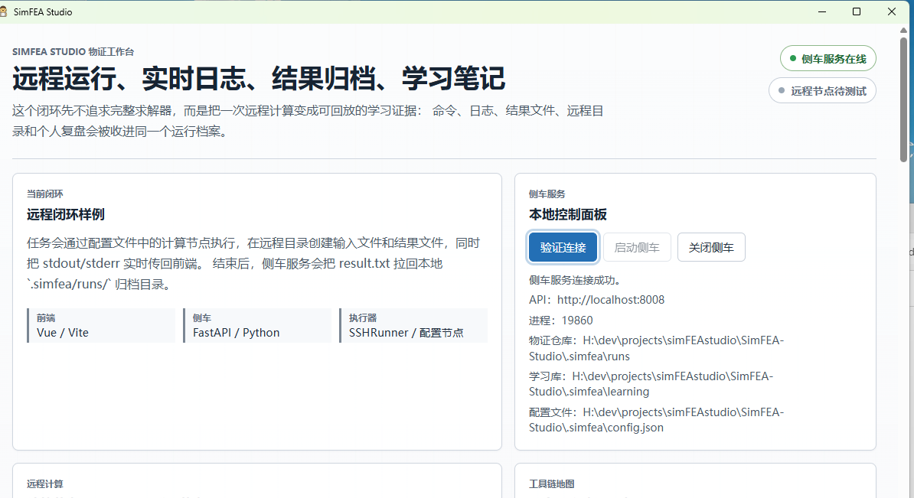

<div align="center">
  <h1>SimFEA Studio</h1>
  <p><strong>仿真学习桌面工作台</strong></p>
  <p>为开源求解器、远程算力和学习记录提供统一的图形化执行环境。</p>

  
  
  
  
  
  
  
  
</div>

<div align="center">
  
  <p><em>SimFEA Studio 桌面版本 — Tauri 桌面壳 + Vue 前端 + 本地 CalculiX 运行</em></p>
</div>

---

## 项目定位

SimFEA Studio 不是新的仿真引擎，不是商业 CAE 的竞品，也不是把物理问题黑盒化的“一键仿真”工具。

它是一个面向机械仿真学习与工程复盘的个人工作台：把已有命令行求解器、远程算力、本地算力、运行日志、结果文件、VTK 可视化和学习笔记收进同一个可回放的物证仓库。

> 不造求解器，只管理求解器、算力、运行环境和学习记录。

当前版本已经从模板验证推进到真实求解链路：本地 CalculiX 悬臂梁算例可以端到端运行，归档 `.frd/.dat/.sta`，转换 FRD 到 VTK，并生成位移、应力摘要。

## 模板来源

本项目最初基于 [AlanSynn/vue-tauri-fastapi-sidecar-template](https://github.com/AlanSynn/vue-tauri-fastapi-sidecar-template) 搭建 `Tauri + Vue + FastAPI sidecar` 技术骨架。

当前仓库已经改造为 SimFEA Studio 的独立项目：原模板主要提供桌面壳、前端和 Python sidecar 的启动链路；本地/远程执行、Slurm 闭环、求解器声明式配置、FRD 到 VTK、物证归档和学习记录沉淀是围绕机械仿真学习目标扩展出来的功能。

## 当前架构

```text
Tauri 桌面壳
→ Vue / Vite 前端 + VTK.js 结果视图
→ FastAPI Python sidecar
→ Local / SSH / Slurm / SolverRunner
→ CalculiX / OpenFOAM / Elmer
→ .simfea/runs/<run_id> 物证仓库
```

SimFEA Studio 的目标不是“替你理解物理”，而是把每一次亲手拆解过的物理概念留下证据：

- 输入：算例脚本、求解器参数、输入文件、工作目录。
- 过程：stdout/stderr 实时日志、调度器状态、JobID、SSE 事件流。
- 结果：求解器原始产物、`result_summary.json`、`solver_result.vtk`。
- 复盘：结构化的 `note.md`（引导式问答）、`learning_report.md`、可导出的学习记录。

## 核心特性

### 桌面外壳，而非求解器

SimFEA Studio 本身不求解任何物理方程。它的职责是在图形界面中管理那些真正会求解的工具。

| 繁琐的事 | SimFEA Studio 替你管理 |
| --- | --- |
| SSH 连接参数、密钥、主机别名 | 统一节点配置，一键探测 |
| 命令在本地还是远程执行 | Runner 抽象，前端无感切换 |
| 手动复制粘贴运行日志 | SSE 流式回传，界面实时显示 |
| 运行记录散落在各处终端 | 每一次运行都归档为学习物证 |
| 求解器输出格式不统一 | artifact glob 收集 + 后处理摘要 |
| 每次跑完不知道记什么 | 引导式问题列表，自动生成结构化笔记 |

### 三层学习沉淀

SimFEA Studio 的学习系统按照"日志 → 笔记 → 报告"的顺序逐层沉淀：

1. **日志流式回传**：运行期间 stdout/stderr 实时 SSE 推送，记录完整的求解过程。
2. **结构化引导笔记**：运行结束后，前端根据求解器类型和运行状态动态生成引导问题（目的、预期对比、疑问、下次改进），用户按问题填写，不再面对空白文本框无从下手。
3. **学习报告自动生成**：笔记保存后，后台将日志摘要、结果指标、用户回答合成为 `learning_report.md`。

三层之间不是并列关系，而是时序依赖：日志跑完才有结果，结果出来才能写笔记，笔记写完才生成报告。

### 声明式求解器接入

求解器定义采用 JSON 声明式配置，借鉴 OpenCAEHub `PluginConfig.xml` 的工程化思路：

- `pre_commands`：求解前命令链，例如环境加载或文件准备。
- `command_template`：求解器命令模板。
- `post_commands`：求解后命令链，例如指标提取。
- `artifact_patterns`：结果文件通配符收集，例如 `*.frd`, `*.dat`, `*.sta`。
- `input_files`：自动写入算例输入文件。

### 统一执行通道

| Runner | 适用场景 | 实现 |
| --- | --- | --- |
| LocalRunner | 本地 Windows / Linux | `subprocess.run`（线程池，避免 Windows 孙进程死锁） |
| SSHRunner | SSH 远程节点 | `ssh` + `scp` 文件操作 |
| SlurmRunner | HPC 集群 | `sbatch` 提交 + `squeue` 轮询 |
| SolverRunner | 求解器编排 | 写输入、跑 solver、收集 artifacts、触发后处理 |

### 结果可视化

- VTK.js 结果视图支持 `.vtk` 和 `.vtu`。
- VTK 模块按需加载，避免拖慢主界面首屏。
- CalculiX FRD 输出可转换为 ASCII VTK unstructured grid。
- 结果摘要会提取 `max_displacement_mm` 和 `max_von_mises_mpa` 等关键指标。

### SSE 运行事件

- 前端实时接收运行日志和状态。
- 后端事件包含单调递增 `seq`。
- 断线重连时前端会用 `/events?from_seq=N` 补回最近遗漏事件。

## 求解器支持

| 求解器 | 状态 | 说明 |
| --- | --- | --- |
| **CalculiX** | 已端到端验证 | 本地悬臂梁算例，FRD → VTK，指标摘要，物证归档。 |
| OpenFOAM | 适配器骨架就绪 | 需要接入真实 case 文件。 |
| Elmer | 适配器骨架就绪 | 需要接入真实 case 文件。 |

### CalculiX 端到端实测

本地 CalculiX v2.10 链路已经打通：

```text
status=finished
exit_code=0
solver=calculix
max_displacement_mm=8.933
max_von_mises_mpa=37.502
artifacts=cantilever.frd, cantilever.dat, cantilever.sta, result.txt, result_summary.json, solver_result.vtk
```

## 物证仓库

```text
.simfea/runs/<run_id>/
├── meta.json                  # 运行元数据（求解器、节点、状态、时间）
├── run.command                # 实际执行的命令
├── stdout.log                 # 标准输出日志
├── stderr.log                 # 标准错误日志
├── events.jsonl               # SSE 事件流回放
├── note.md                    # 结构化引导笔记（Q&A 格式）
├── learning_report.md         # AI 合成的学习报告
├── inputs/                    # 输入文件（.inp 等）
└── artifacts/                 # 求解器输出产物
    ├── cantilever.frd
    ├── cantilever.dat
    ├── cantilever.sta
    ├── result.txt
    ├── result_summary.json
    └── solver_result.vtk
```

`.simfea/` 是本地私有目录，已经被 `.gitignore` 忽略。不要把真实服务器账号、密钥、本地求解器路径或运行归档提交到仓库。

## 快速开始

### 1. 准备环境

推荐使用 miniconda 环境：

```powershell
conda activate simfea
```

需要安装：

- Node.js / Corepack / pnpm
- Python 3.11+
- Rust stable
- Windows OpenSSH
- Tauri 构建依赖

### 2. 安装依赖

```powershell
corepack pnpm install
python -m pip install -e .
```

### 3. 配置计算节点

复制示例配置：

```powershell
New-Item -ItemType Directory -Force .simfea
Copy-Item simfea.config.example.json .simfea\config.json
```

本地 CalculiX 运行示例：

```json
{
  "compute": {
    "default_node": "local",
    "nodes": [
      {
        "alias": "local",
        "label": "Local workstation",
        "host": "localhost"
      }
    ]
  },
  "solvers": [
    {
      "alias": "calculix",
      "executable": "C:\\path\\to\\CalculiX\\bin\\ccx.bat",
      "command_template": "C:\\path\\to\\CalculiX\\bin\\ccx.bat cantilever"
    }
  ]
}
```

### 4. 启动 sidecar

```powershell
python src/backends/main.py
```

### 5. 启动前端

```powershell
corepack pnpm dev:frontend
```

### 6. 触发本地 CalculiX 求解

```powershell
curl -X POST http://localhost:8008/v1/runs/local/solvers/calculix
curl http://localhost:8008/v1/runs
```

## API 概览

| 接口 | 方法 | 作用 |
| --- | --- | --- |
| `/v1/connect` | GET | sidecar 连接和配置摘要 |
| `/v1/config` | GET | API、节点、求解器、学习导出配置 |
| `/v1/compute-nodes` | GET | 计算节点列表 |
| `/v1/compute-nodes/{alias}/probe` | GET | 探测节点连接和环境 |
| `/v1/compute-nodes/{alias}/scheduler-probe` | GET | 探测 Slurm / PBS / LSF 工具 |
| `/v1/compute-nodes/{alias}/solvers/probe` | GET | 探测求解器可执行文件 |
| `/v1/solvers` | GET | 求解器公开定义 |
| `/v1/runs` | GET | 运行归档列表 |
| `/v1/runs/{run_id}` | GET | 单次运行归档详情 |
| `/v1/runs/{alias}/demo` | POST | 启动 SSH demo 运行 |
| `/v1/runs/{alias}/slurm-demo` | POST | 启动 Slurm demo 运行 |
| `/v1/runs/{alias}/solvers/{solver_alias}` | POST | 启动声明式求解器运行 |
| `/v1/runs/{run_id}/events` | GET | SSE 运行事件，支持 `?from_seq=N` |
| `/v1/runs/{run_id}/artifacts/{artifact_path}` | GET | 读取归档产物 |
| `/v1/runs/{run_id}/result-summary` | GET | 读取结果摘要 |
| `/v1/runs/{run_id}/report` | GET | 生成或读取学习报告 |
| `/v1/runs/{run_id}/learning-export` | POST | 导出 md/json/txt 学习记录 |
| `/v1/runs/{run_id}/guided-questions` | GET | 返回该运行的引导问题列表 |
| `/v1/runs/{run_id}/note` | POST | 保存结构化笔记（支持 `answers` 和旧版 `note`） |
| `/v1/runs/{run_id}/cancel` | POST | 请求取消运行 |

## 验证

当前开发日志记录的最新验证：

```powershell
python -m unittest discover -s src/backends/tests -v
corepack pnpm test
corepack pnpm build
python -m py_compile src/backends/main.py src/backends/simfea_api/*.py src/backends/simfea_api/runners/*.py src/backends/inference/*.py
git diff --check
```

已知结果：

- 后端：75 个单元测试通过。
- 前端：20 个 Vitest 测试通过。
- 生产构建通过，仅保留 VTK XML reader 按需 chunk 偏大的提示。

## 文档

- `docs/DEV_LOG_2026-05-13.md`：结构化引导笔记、学习报告修复、asyncio 死锁修复。
- `docs/DEV_LOG_2026-05-12.md`：开发日志和验证记录。
- `docs/ARCHITECTURE_ROADMAP.md`：架构路线图，以及 sim-main / OpenCAEHub 借鉴分析。
- `docs/RUNNER_DESIGN.md`：Runner 边界和执行模型。
- `docs/API_CONTRACTS.md`：API 契约和示例响应。
- `docs/AI_FEA_EXPLORATION_NOTE_2030.md`：AI + 有限元探索笔记和项目介绍。

## 路线图

- [x] Vue / Tauri / FastAPI sidecar 闭环。
- [x] SSH 远程运行和物证归档。
- [x] Slurm 提交、轮询和取消。
- [x] LocalRunner 本地运行。
- [x] 声明式 SolverRunner。
- [x] SSE 断线重连和 `from_seq` 回放。
- [x] VTK.js 结果视图。
- [x] CalculiX 本地端到端链路。
- [x] CalculiX FRD → VTK 转换。
- [x] 结构化引导笔记 + 学习报告自动生成。
- [ ] OpenFOAM 真实 case 接入。
- [ ] Elmer 真实 case 接入。
- [ ] FreeCAD / Salome 前处理入口。
- [ ] AI 辅助工程证据评分和复盘建议。

## License

Apache-2.0。

本项目代码以仓库根目录的 `LICENSE` 为准。项目最初使用的 Tauri + Vue + FastAPI sidecar 模板，以及 Vue、Tauri、FastAPI、VTK.js、CalculiX 等第三方工具或依赖，分别遵循其各自的许可证；在使用、分发或集成这些第三方组件时，请同时遵守对应项目的许可条款。
